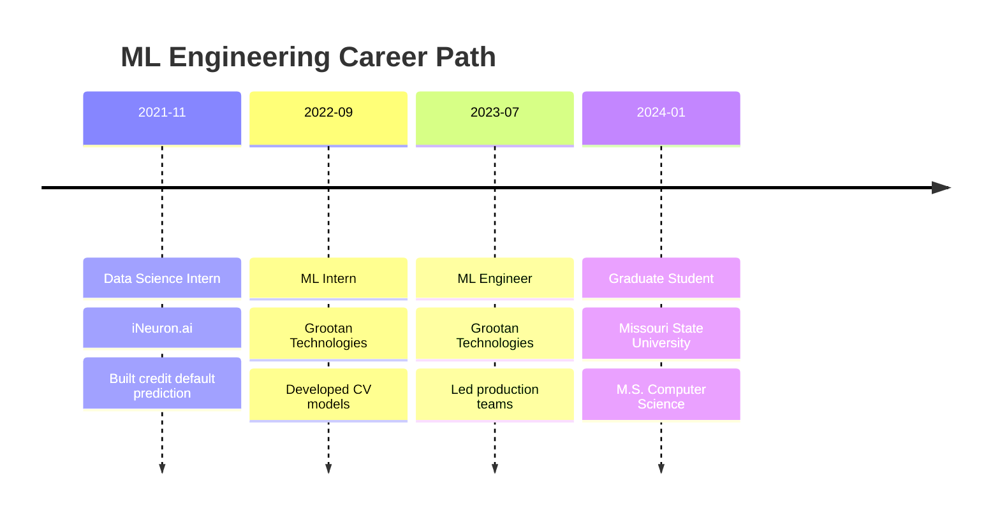

<p align="center">
  
</p>

<h1 align="center">
  
</h1>

<p align="center">
  <a href="https://linkedin.com/in/sai-sujan-6110a4190">
    
  </a>
  <a href="mailto:sujanworkofficial@gmail.com">
    
  </a>
  <a href="https://sai-sujan.github.io/My-portfolio">
    
  </a>
  <a href="tel:+19408430811">
    
  </a>
</p>

<p align="center">
  
  
  
  
</p>

<br>

<div align="center">
  
</div>

<br>


### 🎯 About Me

```yaml
name: Sujan Dora
location: 📍 Springfield, Missouri, USA
role: 🤖 Machine Learning Engineer
education: 🎓 M.S. Computer Science @ Missouri State University
gpa: 3.63/4.0
graduation: December 2025
status: 💼 Open to Full-Time Opportunities
work_authorization: F-1 OPT (36-month STEM extension)

expertise:
  - Computer Vision & Image Processing
  - Natural Language Processing & LLMs
  - MLOps & Production Deployment
  - Deep Learning & Neural Networks
  - Cloud Architecture (AWS)
  
impact:
  - 15% reduction in false positives
  - 40% faster verification systems
  - 99% production reliability
  - 97% cloud cost optimization
  - Led teams of 4-12 developers
```

<br clear="right"/>

---

<div align="center">
  
</div>

## 🏆 Impact Metrics & Achievements

<div align="center">

<table>
<tr>
<td align="center" width="33%">

<br><br>
<b>🔒 Security Enhancement</b>
<br><br>

<br>
<sub>MFA Systems | 10K+ Daily Auth</sub>
</td>
<td align="center" width="33%">

<br><br>
<b>⚡ Performance Boost</b>
<br><br>

<br>
<sub>Face Verification | 5K+ Sessions/Week</sub>
</td>
<td align="center" width="33%">

<br><br>
<b>💰 Cost Optimization</b>
<br><br>

<br>
<sub>AWS Lambda | $7.50 → $0.20/month</sub>
</td>
</tr>
<tr>
<td align="center" width="33%">

<br><br>
<b>🎯 Data Accuracy</b>
<br><br>

<br>
<sub>Anomaly Detection | 10K+ Records/Day</sub>
</td>
<td align="center" width="33%">

<br><br>
<b>🚀 System Reliability</b>
<br><br>

<br>
<sub>ML Systems | Team of 4 Engineers</sub>
</td>
<td align="center" width="33%">

<br><br>
<b>⚙️ API Performance</b>
<br><br>

<br>
<sub>Wine Quality Pipeline | 99.9% Uptime</sub>
</td>
</tr>
</table>

</div>

---

<div align="center">
  
</div>

## 💻 Technology Stack

<div align="center">

### 🤖 Machine Learning & AI


### ⚙️ MLOps & DevOps


### ☁️ Cloud & Infrastructure


### 🛠️ Development Tools


</div>

---

<div align="center">
  
</div>

## 🚀 Featured Projects

<div align="center">

### 🍷 Wine Quality Prediction - Enterprise MLOps Pipeline
[](https://github.com/sai-sujan/wine-quality-mlops)
[](https://github.com/sai-sujan/wine-quality-mlops)


</div>

<table>
<tr>
<td width="50%">

#### 🎯 Highlights
- ⚡ **186ms** API response time
- 💰 **97% cost reduction** ($7.50 → $0.20/month)
- 📦 **90% smaller** deployment (300MB → 60MB)
- 🔄 Fully automated CI/CD pipeline
- 🐳 Multi-stage Docker optimization
- 📊 MLflow tracking & model registry

#### 🛠️ Tech Stack
```python
{
  'ML': 'Scikit-learn, Pandas, NumPy',
  'MLOps': 'ZenML, MLflow, DVC',
  'Cloud': 'AWS Lambda, S3, ECR',
  'DevOps': 'Docker, GitHub Actions',
  'API': 'FastAPI, Uvicorn'
}
```

</td>
<td width="50%">

#### 📊 Metrics

| Metric | Value | Status |
|--------|-------|--------|
| **Accuracy** | 92% | ✅ |
| **Latency** | 186ms | ✅ |
| **Uptime** | 99.9% | ✅ |
| **Cost/Month** | $0.20 | ✅ |
| **Build Time** | <5 min | ✅ |
| **Image Size** | 60 MB | ✅ |

<br>


</td>
</tr>
</table>

---

<div align="center">

### 🫁 Lung Cancer Detection - Vision Transformers
[](https://github.com/sai-sujan/lung-cancer-vit)
[](https://github.com/sai-sujan/lung-cancer-vit)


</div>

<table>
<tr>
<td width="50%">

#### 🎯 Highlights
- 🧠 **92% accuracy** with Vision Transformers
- 🏥 Real-time CT scan analysis
- 🌐 Production Streamlit deployment
- 📊 Advanced preprocessing pipeline
- 🔬 Medical-grade classification
- ⚡ Optimized inference speed

#### 🏗️ Architecture
```
Input (224×224×3)
       ↓
Vision Transformer Encoder
       ↓
Multi-Head Attention (12 heads)
       ↓
Feed-Forward Network
       ↓
Classification Head (4 classes)
```

</td>
<td width="50%">

#### 🔬 Technical Details

- **Model:** Vision Transformer (ViT-B/16)
- **Dataset:** IQ-OTHNCCD Lung Cancer
- **Classes:** 4 cancer types
- **Accuracy:** 92%
- **Framework:** TensorFlow 2.x
- **Deployment:** Streamlit Cloud

<br>


</td>
</tr>
</table>

---

<div align="center">

### 🍳 Cooking AI Assistant & ✈️ British Airways Analytics

</div>

<table>
<tr>
<td width="50%">

<div align="center">

[](https://github.com/sai-sujan/cooking-ai-app)


</div>

#### 🤖 Gemini LLM Mobile App

- 📱 Flutter cross-platform application
- 🧠 Google Gemini Pro integration
- 🥘 Personalized recipe generation
- 💡 Real-time nutrition analysis
- 🎯 Ingredient-based recommendations


</td>
<td width="50%">

<div align="center">

**📊 BA Customer Analytics Dashboard**

</div>

#### ✈️ Key Features

- 📈 Interactive Tableau dashboard
- ✈️ 50,000+ customer reviews
- 🌍 Geographic sentiment mapping
- 📉 Service quality trends
- 🎯 Data-driven recommendations
- 💼 Executive insights


**Insights:** Customer satisfaction • Route performance • Service improvements

</td>
</tr>
</table>

---

<div align="center">
  
</div>

## 💼 Professional Journey

<div align="center">



</div>

<details open>
<summary><b>🏢 Machine Learning Engineer | Grootan Technologies</b></summary>

**July 2023 – December 2023 | Chennai, India**

```python
achievements = {
    'security': {'false_positive_reduction': '15%', 'daily_auth': '10,000+'},
    'leadership': {'team_size': 4, 'accuracy_boost': '25%', 'reliability': '99%'},
    'performance': {'inference_speed': '+35%', 'application': 'Real-time MFA'},
    'code_quality': {'developers_mentored': 12, 'error_reduction': '20%'},
    'product': {'engagement_increase': '30%', 'active_users': '500+'}
}
```

**Key Achievements:**
- 🔒 Deployed anomaly detection for MFA reducing false positives by **15%**
- 👥 Led team of **4 developers** achieving **99% reliability**
- ⚡ Optimized ML inference by **35%** for real-time systems
- 👨‍💻 Conducted code reviews for **12 developers**, reducing errors by **20%**
- 🖥️ Enhanced desktop app increasing engagement by **30%**

</details>

<details>
<summary><b>🏢 Machine Learning Intern | Grootan Technologies</b></summary>

**September 2022 – July 2023 | Chennai, India**

- 🆔 Hologram detection: **95% precision** across **20,000+ documents**
- 👤 Face verification: **40% faster**, **98% accuracy**, **5,000+ sessions/week**
- 🚫 Fraud reduction: **25%** across **100,000+ transactions**
- 🚀 Deployment optimization: **30% faster** through testing pipelines

</details>

<details>
<summary><b>🏢 Data Science Intern | iNeuron.ai</b></summary>

**November 2021 – March 2022 | Bengaluru, India**

- 💳 Credit default prediction: **87% accuracy** (Docker + CircleCI + Heroku)
- 🔄 CI/CD pipeline: **50% deployment downtime** reduction
- 📊 EDA on **30,000+ records**: **12% performance** improvement
- ⚡ Data preprocessing: **60% time** reduction

</details>

---

<div align="center">
  
</div>

## 📊 GitHub Statistics

<div align="center">


</div>

---

<div align="center">
  
</div>

## 🏆 Recognition & Publications

<div align="center">

| 🎖️ Achievement | 📄 Details |
|:-------------:|:----------|
| **📜 IEEE Publication** | "Detecting Bias in the Relative Grading System Using Machine Learning" |
| **👥 Team Leadership** | Led 4-member team to 99% system reliability in production |
| **📝 Code Excellence** | Mentored 12 developers, achieved 20% error reduction |
| **🎓 Academic Merit** | 3.63/4.0 GPA in M.S. Computer Science |
| **🚀 Production Scale** | ML models serving 10,000+ daily users |
| **💰 Cost Innovation** | 97% infrastructure cost optimization |
| **⚡ Performance** | 40% speed improvement in critical systems |

</div>

---

<div align="center">
  
</div>

## 💡 Currently Focused On

<div align="center">

<table>
<tr>
<td width="50%">

### 🎓 Education
```javascript
{
  degree: "M.S. Computer Science",
  university: "Missouri State University",
  gpa: "3.63/4.0",
  graduation: "December 2025",
  specialization: "Machine Learning & AI"
}
```

### 🔍 Job Search
```javascript
{
  seeking: "Full-time ML Engineer",
  sponsorship: "H-1B required",
  authorization: "F-1 OPT",
  extension: "36-month STEM",
  availability: "December 2025"
}
```

</td>
<td width="50%">

### 📚 Learning
- Advanced LLM Fine-tuning & RAG
- Distributed Training at Scale
- Real-time ML System Design
- Advanced MLOps Patterns
- Cloud-Native Architectures

### 🛠️ Building
- Production ML Pipelines
- Computer Vision Applications
- LLM-Powered Solutions
- End-to-End MLOps Systems
- Scalable AI Infrastructure

</td>
</tr>
</table>

</div>

---

<div align="center">
  
</div>

## 🤝 Open for Collaboration

<div align="center">

### 🎯 Seeking Opportunities In

<table>
<tr>
<td align="center" width="25%">

<br><br>
<b>Production ML</b>
<br><sub>Scalable AI Systems</sub>
</td>
<td align="center" width="25%">

<br><br>
<b>Computer Vision</b>
<br><sub>Image & Video Analysis</sub>
</td>
<td align="center" width="25%">

<br><br>
<b>NLP & LLMs</b>
<br><sub>Language AI Solutions</sub>
</td>
<td align="center" width="25%">

<br><br>
<b>MLOps</b>
<br><sub>CI/CD & Deployment</sub>
</td>
</tr>
</table>

</div>

---

<div align="center">
  
</div>

## 📬 Let's Connect!

<div align="center">

<a href="mailto:sujanworkofficial@gmail.com">
  
</a>

<a href="https://linkedin.com/in/sai-sujan-6110a4190">
  
</a>

<a href="https://sai-sujan.github.io/My-portfolio">
  
</a>

<a href="https://github.com/sai-sujan">
  
</a>

<br><br>

### 💬 Let's Discuss
**ML Projects** • **Job Opportunities** • **Research Collaborations** • **Technical Consulting**

<br>


</div>

---

<div align="center">

### 🌟 "Transforming Data into Intelligent Solutions" 🌟

<br>

[](https://github.com/sai-sujan)

</div>

---

<p align="center">
  
</p>
